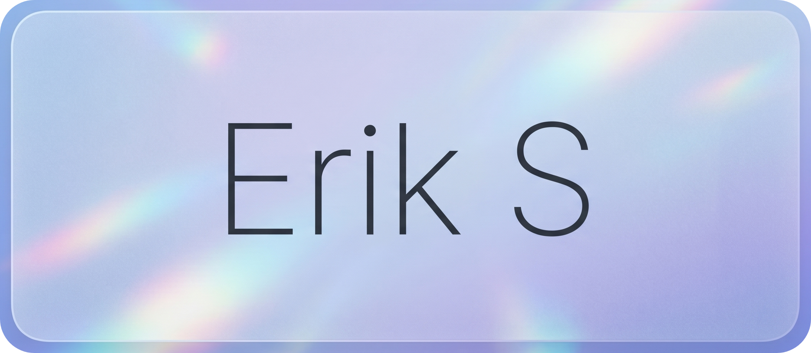

  

  <h2>Hi, I'm Erik</h2>
  
<b>JavaScript Developer // Android Developer // Open Source Contributor</b>

  
  

    I'm a passionate developer currently working on multiple projects and learning <b>AOSP, Java, and Kotlin</b>.
     
    Always looking to collaborate on interesting <b>Projects</b> and <b>Android Modding</b>.
  

  

 

  <h3>Languages</h3>
  
  
  <h3>Frameworks, Libraries & Runtime</h3>
  
  
  <h3>Databases & Cloud</h3>
  
  
  <h3>Tools</h3>
  

 

  

<!---
AKPR2007/AKPR2007 is a ✨ special ✨ repository because its `README.md` (this file) appears on your GitHub profile.
You can click the Preview link to take a look at your changes.
--->
